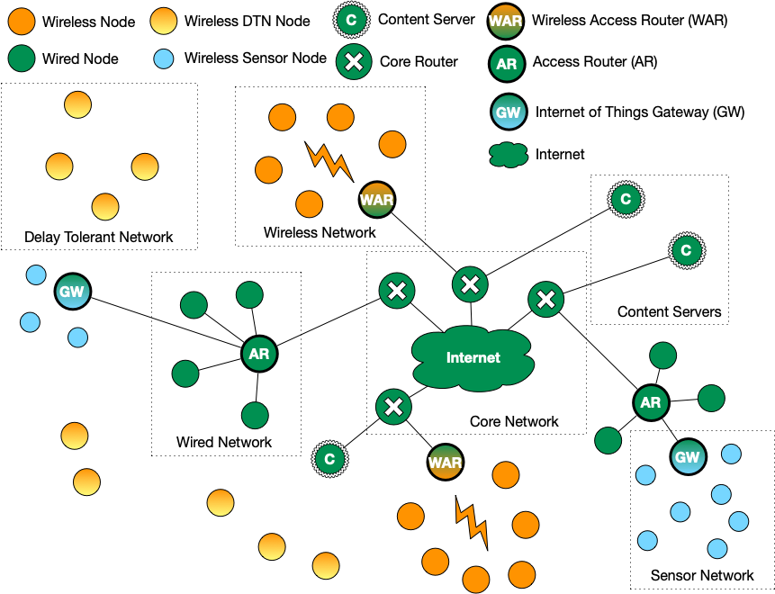
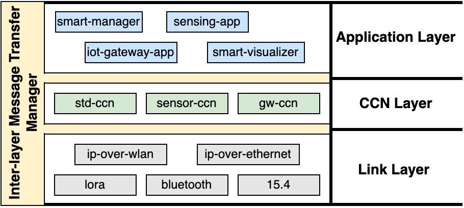

# inbaverSys

**inbaverSys** is a Python based Content Centric Networking (CCN) implementation for the 
Internet of Things (IoT). The implementation consist of a single CCN node with a 3-layer 
protocol architecture. It has a modular architecture where each layer can be setup to
use different modules to operate as a functionally specific CCN node. There are 3 types 
of functionally specific nodes that can be configured.

- **Standard Node** - a traditional CCN node such as a client or content server
- **Sensor** - a CCN based sensor node
- **Gateway** - a gateway that connects tradional CCN nodes of the Internet and sensors of a sensor network

The following picture depicting a CCN based network topology shows the different CCN nodes 
that could be configured using the implementation in this repository.

<p align="center">
  
</p>


## Implementation Architecture

A CCN node consist of a 3-layer protocol architecture. Each layer can be configured with
multiple modules based on the operation expected of the node. The following picture shows 
protocol layers and the possible modules that can be deployed. 

<p align="center">
  
</p>

The description below explains purpose of the layers and the modules tha can be configured.

#### Application Layer

The **Application Layer** is configured on CCN nodes that require the deployment of
applications to request and/or serve content. Examples are client computers that download
content, content servers that host content or IoT gateways that act as the intermediary 
between the Internet and sensor networks.


#### CCN Layer

The **CCN Layer** is where the CCN based forwarder is deployed. There could be different 
flavours of CCN that implements the CCN functionality specific to the node types described
above. For a **Standard Node**, the CCN flavour implements the functionality described in 
the CCN RFCs ([RFC8569](https://datatracker.ietf.org/doc/html/rfc8569) and 
[RFC8609](https://datatracker.ietf.org/doc/html/rfc8609)). An example is any Internet
based node.

For a **Sensor**, a scaled down version of the CCN forwarding is implemented due to the
resource restricted nature of the device. Therefore, it may support a subset of CCN
functionality described in the above RFCs. Additionally, it may have additional
functionality to overcome specficic problems faced in sensor networks (e.g., converting 
long names to short names).

For a **Gateway**, the CCN layer must implement the CCN forwarding that understands the 
CCN of the gateway side and the Internet side - with the ability to translate between 
these 2 flavours.


#### Link Layer

The **Link Layer** is where all the different modules that is able to operate over link
technologies are implemented. Examples are, IP-over-WLAN, IP-over-Ethernet and LoRa.


## Installing and Running

Installing and running the implementation varies based on the type of node on which it is
deployed.

#### Standard Node

A **Standard Node** is a computer that runs an desktop or server operating system (such as 
Linux, MacOS or Windows) and is installed with the Python interpretter. The procedure
of installation and running is as follows.


1. Install Python
2. Copy the `settings.node.py` as `settings.py`
3. Configure the `settings.py` to suit the environment and the operation
4. Run the `main.py` Python script


#### Sensor

A **Sensor** is usually a device with a microcontroller such as the ESP32 that is deployed
with a Python-capable firmware. Refer to the instructions relevant to your microcontroller
on how programs are deployed. Usually, they are run automatically when the device is booted.
The procedure, before the microcontroller specific procedure is applied is as follows.

1. Copy the `settings.sensor.py` as `settings.py`
2. Configure the `settings.py` to suit the environment and the operation
3. Follow the microcontroller specific procedure to deploy on the microcontroller
4. Boot the microcontroller device


#### Gateway

A **Gateway** can be a microprocessor based system such as a Raspberry Pi or a microcontroller 
such as an ESP32 that is able to handle the mixed operation of translating between the CCN 
flavours of standard CCN and CCN operating on sensors. Therefore, the procedure would either
be similar to the **Standard Node** or to the **Sensor**. But, whatever procedure followed,
remember to copy the `settings.gateway.py` as `settings.py`.


## Developing Modules

The implementation has some basic models developed for each type of node. There are 3
types of modules that can be developed (see **Implementation Architecture** picture above).

- Application module
- CCN module
- Link module

The **Application** and **Link** modules are considered as CCN **Faces** and therefor must register with the **CCN** module before they can receive messages.

Below are some noteworthy information.

#### Main Function

The `main.py` implements the setup and coordination of the whole program. It uses the `settings.py` file to import the modules based on the configuration. The `main.py` has a function caled `dispatch(encap)` which is called by each CCN, application or link module when a message has to be passed between modules. The operation of this function is given below.

```python:

  # All layer handling modules (e.g. eth, tempreader, stdccn) will call 
  # dispatch to deliver to their packets to other layer handling 
  # modules. The encap must carry information about where to deliver.
  def dispatch(encap):


    # CCN module destined packet
    if encap.to_direcion == common.DirectionType.TO_CCN:
        ccnmodule.face_handler_ref.handle_msg(encap)

    # application module destined packet, find from list
    else if encap.to_direcion == common.DirectionType.TO_APP:
        for modinfo in appmodules:
            if encap.to_direction_module_name == modinfo.module_name:
                modinfo.face_handler_ref.handle_msg(encap)

    # link module destined packet, find from list
    else if encap.to_direcion == common.DirectionType.TO_LINK:
        for modinfo in linkmodules:
            if encap.to_direction_module_name == modinfo.module_name:
                modinfo.face_handler_ref.handle_msg(encap)

```

#### Setting up Modules (Applications and Links)

Every module (i.e., CCN, Application and Link) must implement the `setup(dispatch)` function that is called by `main.py` to setup the the modules. This function must return an object that has a function called `handle_msg(encap)`. The general structure of the code is as follows.

```python:
  # setup app module & start the face handler thread
  def setup(dispatch):
    
    # start app worker that generates interests
    w = Worker(dispatch)
    w.start()

    # create the handler
    handler = Handler(dispatch)
    
    # return the handler for main to call the 
    # handle_msg function
    return handler

```

#### Worker class

The `Worker` class extends Python's `threading.Thread` class to implement a thread that performs the tasks of the application or link. In the case of an application, the thread first has to register the face with CCN layer by calling the `dispatch(encap)` function. Then, it may implement an endless loop to request for data, e.g., an application that regularly requests temperature. Or, the application may be a server that serves content, e.g., the gateway application that hosts temperature values.


#### Handler class

The `Handler` class implements the function of handling incomming messages. It implements the `handle_msg(encap)` function called by the CCN module.

#### Example Code

1. `tempreader.py` - shows an example of an application that requests data regularly
2. `iotgwapp.py` - shows an application that serves content when requested
3. `ipovereth.py` - shows a link implementation to send and receive packets over an IP socket
4. `stdccn.py` - shows an implementation of a dummy CCN forwarder


## Caveat

This is a work-in-progress. So, not all modules and informational files are implemented. 
The modules developed are located in the [src](./src/) folder.


## Questions or Comments

If you have any questions or comments, please write to us at inbaversys@comnets.uni-bremen.de.

